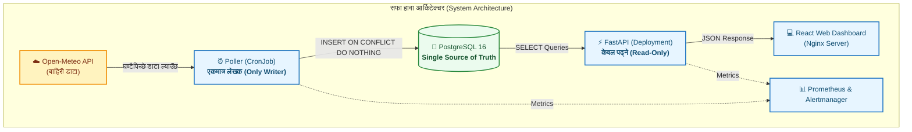
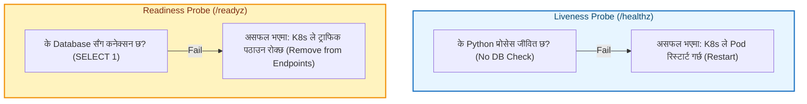
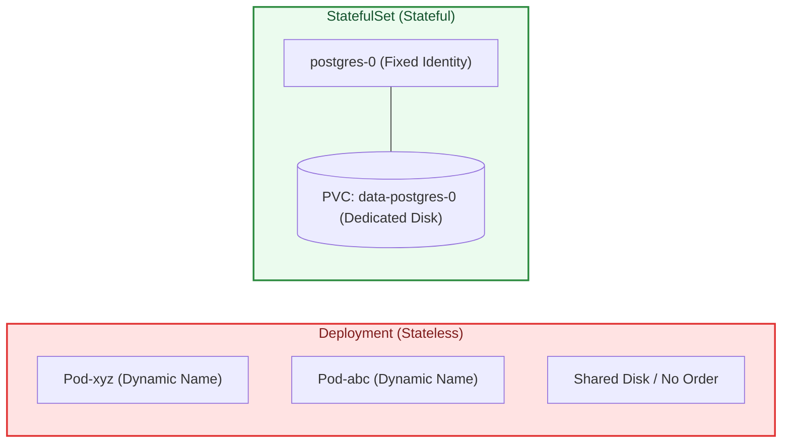
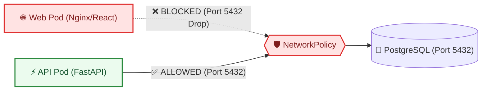

# सफा हावा — DevOps & Kubernetes इन्टरभ्यु तयारी गाइड (Interview Q&A Guide)
### *"इन्टरभ्युमा आत्मविश्वासका साथ यसरी जवाफ दिनुहोस्"*

यो गाइड विशेष गरी तपाईंलाई DevOps, Platform Engineering, र Kubernetes का प्राविधिक इन्टरभ्युहरूमा सोधिने मुख्य प्रश्नहरूको तयारी गर्नका लागि नेपालीमा तयार पारिएको हो। 

प्रत्येक प्रश्नमा:
1. **कन्सेप्ट (Concept)**: त्यो प्रविधिले भित्र कसरी काम गर्छ भन्ने कुरा सरल भाषामा।
2. **इन्टरभ्युमा यसरी भन्नुहोस् (Interview Answer)**: इन्टरभ्युवर वा सिनियर इन्जिनियर अगाडि बोल्ने स्पष्ट र प्राविधिक शब्दहरू।

---

## 🧭 इन्टरभ्युको ओपनिङ स्टेटमेन्ट (Opening Statement)

इन्टरभ्यु सुरु गर्दा सधैं स्पष्ट र इमान्दार भएर यो वाक्यबाट सुरु गर्नुहोस्:

> *"The application code was provided to me. My work is everything from the Dockerfile onward — containers, pipeline, cluster, observability — plus three features I added to the API."*
> 
> *(नेपाली भाव: "एप्लिकेसन कोड मलाई दिइएको थियो। मेरो मुख्य काम डकरफाइल, कन्टेनराइजेसन, सीआई/सीडी पाइपलाइन, कुबरनेटिज क्लस्टर, मोनिटरिङ र तीनवटा नयाँ एपीआई फिचरहरू थप्ने हो।")*

---

## खण्ड १: मुख्य ९ वटा प्रेजेन्टेसन प्रश्नहरू (Core 9 Questions)



---

### प्रश्न १: ह्वाइटबोर्डमा मेमोरीबाट आर्किटेक्चर कोरेर बुझाउनुहोस्। (Draw the architecture from memory)

#### 💡 मुख्य कन्सेप्ट:
यो सिस्टममा ३ वटा टियर (Tier) र ४ वटा प्रोसेस छन्:
1. **Frontend**: React SPA जसलाई Nginx ले सर्भ गर्छ।
2. **Backend**: FastAPI सर्भिस, जुन **पढ्ने काम मात्र (Read-Only)** गर्छ। यसमा कुनै पनि डाटा लेख्ने (POST/PUT/DELETE) रूट छैन।
3. **Database**: PostgreSQL 16 (डेटाबेस)।
4. **Data Poller**: छुट्टै पाइथन प्रोसेस, जुन समय-समयमा चल्छ र Open-Meteo बाट काठमाडौंका ८ वटा स्टेसनको हावाको गुणस्तर (AQI) ल्याएर डेटाबेसमा लेख्छ। डेटाबेसमा लेख्ने **एकमात्र प्रोसेस** पोलर हो।

#### 🗣️ इन्टरभ्युमा यसरी भन्नुहोस्:
> "हाम्रो सिस्टम ३-टियर आर्किटेक्चरमा बनेको छ। अगाडि React वेब ड्यासबोर्ड छ, जसले FastAPI ब्याकइन्डसँग HTTP मार्फत कुरा गर्छ। FastAPI ले PostgreSQL बाट डाटा पढेर देखाउँछ। ब्याकग्राउन्डमा एउटा छुट्टै पाइथन पोलर (Poller) छ, जसले Open-Meteo एपीआईबाट काठमाडौं उपत्यकाका ८ वटा स्टेसनको डाटा तानेर डेटाबेसमा हाल्छ। यहाँ मुख्य कुरा के छ भने—**पोलर मात्र डेटाबेसमा लेख्ने सर्भिस हो, एपीआई पूर्ण रूपमा Read-Only छ।**"

---

### प्रश्न २: एउटै पाइथन सर्भिस बनाउनुको साटो दुईवटा किन बनाइयो? (Why two Python services instead of one?)

#### 💡 मुख्य कन्सेप्ट:
API र Poller को काम गर्ने तरिका (Workload pattern) एकअर्कासँग बिल्कुल मिल्दैन:
* **API**: २४ सै घण्टा चल्नुपर्छ। युजर ट्राफिक बढ्यो भने होरिजोन्टल स्केल (Pod संख्या २ बाट ५) गर्नुपर्छ।
* **Poller**: ब्याच प्रोसेस (Batch Job) हो। यो घण्टामा एक पटक २ सेकेन्डको लागि मात्र चल्छ। यदि यसलाई पनि API सँगै एउटै कन्टेनरमा राखेर स्केल गरियो भने, ५ वटा पोलरले एकै समयमा एउटै डाटा तान्न थाल्छन्, जसले गर्दा डुप्लिकेट रिक्वेस्ट र अनावश्यक रिसोर्स खेर जान्छ।

#### 🗣️ इन्टरभ्युमा यसरी भन्नुहोस्:
> "किनकि दुवैको वर्कलोड (Workload) चरित्र एकदमै फरक छ। एपीआई प्रयोगकर्ताको ट्राफिक अनुसार जुनसुकै बेला स्केल हुनुपर्छ। तर पोलर एउटा निश्चित समयमा मात्र चल्ने ब्याच प्रोसेस हो। यदि दुवैलाई एउटै कन्टेनरमा मिसाएको भए, ट्राफिक बढ्दा एपीआईसँगै पोलर पनि मल्टिपल इन्स्ट्यान्समा चल्थ्यो र सबैले एउटै बाहिरी एपीआईलाई एकैसाथ कल गरेर डेटाबेसमा रेस-कन्डिसन ल्याउँथे। त्यसैले हामीले दुवैलाई अलग गर्यौं।"

---

### प्रश्न ३: यदि पोलर एकै समयमा दुई पटक चल्यो भने के हुन्छ? (What if the poller runs twice at the same time?)

#### 💡 मुख्य कन्सेप्ट:
हाम्रो डेटाबेस टेबल `station_readings` मा `(station_id, observed_at)` को **UNIQUE Constraint** राखिएको छ। साथै, पोलरले डाटा इन्सर्ट गर्दा निम्न क्वेरी प्रयोग गर्छ:
```sql
INSERT INTO station_readings (...) VALUES (...)
ON CONFLICT (station_id, observed_at) DO NOTHING;
```
यदि दुईवटा पोलर एकै समयमा चले पनि पहिलोले डाटा लेख्छ र दोस्रोले त्यसलाई स्वतः छोडिदिन्छ (Ignore गर्छ)। यसलाई कम्प्युटर साइन्समा **Idempotency** भनिन्छ।

#### 🗣️ इन्टरभ्युमा यसरी भन्नुहोस्:
> "केही पनि बिग्रिँदैन, सिस्टम पूर्ण रूपमा सुरक्षित छ। डेटाबेसमा `(station_id, observed_at)` मा `UNIQUE` कन्स्ट्रन्ट छ। पोलरले डाटा इन्सर्ट गर्दा `ON CONFLICT DO NOTHING` चलाउँछ। त्यसैले दुईवटा पोलर एकैचोटि चले पनि कुनै डुप्लिकेट डाटा बस्दैन र कुनै एरर पनि आउँदैन।"

---

### प्रश्न ४: `/healthz` र `/readyz` मा के फरक छ? (Why is /healthz different from /readyz?)



#### 💡 मुख्य कन्सेप्ट:
* **Liveness (`/healthz`)**: प्रोसेस आफैं अड्किएको (Deadlock) छ कि छैन हेर्छ। यसले कुनै बाहिरी डाटाबेस छुँदैन।
* **Readiness (`/readyz`)**: पोडले अहिले ट्राफिक लिन सक्छ कि सक्दैन (डेटाबेस चलिरहेको छ कि छैन) हेर्छ।
* **खतरा**: यदि `/healthz` भित्र डाटाबेस चेक राखियो भने, डाटाबेसमा १० सेकेन्डको अस्थायी समस्या आउनासाथ कुबरनेटिजले सबै API पोडहरूलाई एकैचोटि मारेर रिस्टार्ट गरिदिन्छ (Cascading Outage)।

#### 🗣️ इन्टरभ्युमा यसरी भन्नुहोस्:
> "लाइभनेस (`/healthz`) ले कन्टेनरको प्रोसेस जीवित छ कि छैन मात्र जाँच्छ। यदि यो फेल भयो भने कुबरनेटिजले पोडलाई रिस्टार्ट गर्छ। रेडिनेस (`/readyz`) ले डाटाबेससँग सम्पर्क छ कि छैन जाँच्छ। यदि डाटाबेस केही समय डाउन भयो भने `/readyz` ले गर्दा कुबरनेटिजले त्यो पोडमा ट्राफिक पठाउन बन्द गर्छ तर पोडलाई मार्दैन। यदि हामीले `/healthz` मा डाटाबेस चेक राखेको भए, डाटाबेस केही बेर स्लो हुँदा कुबरनेटिजले सबै एपीआई पोडहरूलाई एकैपटक मारेर पूरै सिस्टम क्र्यास गराउँथ्यो।"

---

### प्रश्न ५: तपाईंको डकर इमेज कति साइजको छ? के-के राख्नुभयो र के हटाउनुभयो? (Your image is N MB. What is in it, and what did you remove?)

#### 💡 मुख्य कन्सेप्ट:
हामीले **मल्टी-स्टेज बिल्ड (Multi-stage build)** प्रयोग गर्यौं:
* API इमेज: ~312 MB (अनकम्प्रेस्ड) / ~75 MB (कम्प्रेस्ड)। बेस इमेज: `python:3.12-slim`।
* पहिलो स्टेज (`builder`) मा सफ्टवेयर कम्पाइल गर्न आवश्यक पर्ने टूल्स (`gcc`, डेभलपमेन्ट हेडर्स) इन्स्टल गरियो र पाइथन ह्विल्स (wheels) बनाइयो।
* दोस्रो स्टेज (`runtime`) मा ती बनेका ह्विल्स मात्र सारियो। `gcc`, क्यास फाइलहरू, र अप्रয়োজনীয় फाइलहरू हटाइयो।
* इमेजलाई नन-रुट युजर `UID 10001` (`hawa`) मा चलाइयो र बाइनरीहरूबाट SUID/SGID हटाइयो।

#### 🗣️ इन्टरभ्युमा यसरी भन्नुहोस्:
> "हाम्रो एपीआई इमेजको कम्प्रेस्ड साइज करिब ७५ एमबी छ। हामीले `python:3.12-slim` मा मल्टी-स्टेज डकर बिल्ड प्रयोग गरेका छौं। बिल्डर स्टेजमा मात्र कम्पाइलर र बिल्ड टूल्स राखिएको थियो, तर फाइनल रनटाइम इमेजमा आवश्यक पाइथन प्याकेजहरू मात्र सारियो। हामीले कम्पाइलर, क्यास, र अप्रয়োজনীয় सिस्टम बाइनरीहरू हटाएका छौं, र कन्टेनरलाई सुरक्षित राख्न नन-रुट युजर (UID 10001) मा चलाएका छौं।"

---

### प्रश्न ६: डाटाबेसको पासवर्ड कहाँ बस्छ र कसले पढ्न सक्छ? (Where does the database password live, and who can read it?)

#### 💡 मुख्य कन्सेप्ट:
* कुबरनेटिजमा पासवर्ड `Secret` अब्जेक्ट (`safahawa-secrets`) भित्र सुरक्षित राखिन्छ र पोडमा इन्भायरमेन्ट भेरिएबलको रूपमा मात्र इन्जेक्ट गरिन्छ।
* Git मा पासवर्ड कहिल्यै कमिट गरिँदैन (`.gitignore` मा `.env` राखिएको छ)।
* आरब्याक (RBAC) पोलिसी अनुसार क्लस्टर एडमिन बाहेक अरु साधारण युजर वा डेभलपरले त्यो सिक्रेट पढ्न पाउँदैनन्।

#### 🗣️ इन्टरभ्युमा यसरी भन्नुहोस्:
> "कुबरनेटिज क्लस्टरमा पासवर्ड `Secret` अब्जेक्टमा रहन्छ, जुन सिधै पोडको इन्भायरमेन्टमा पास हुन्छ। कोड रिपोजिटरी वा गिटमा पासवर्ड कहिल्यै राखिँदैन। स्थानीय विकास (Local development) मा यो `.env` फाइलमा हुन्छ जुन `.gitignore` ले रोक्छ। क्लस्टरमा आरब्याक (RBAC) नियम लगाएर केवल अधिकार प्राप्त सर्भिस एकाउन्टले मात्र यसलाई पढ्न सक्छ।"

---

### प्रश्न ७: ड्यासबोर्डमा AQI ४० देखायो। त्यो अहिलेकै हो कि मंगलबारको पुरानो डाटा हो कसरी थाहा पाउने? (Dashboard shows AQI 40. How to know it's fresh?)

#### 💡 मुख्य कन्सेप्ट:
हाम्रो सिस्टमले डाटाको ताजगी (Freshness) आफैं ट्र्याक गर्छ:
1. प्रत्येक रिडिङसँगै `observed_at` टाइमस्ट्याम्प हुन्छ।
2. API ले `/api/v1/ingest/status` मा पछिल्लो डाटा कति मिनेट पुरानो हो (`data_age_minutes`) हिसाब गर्छ।
3. यदि डाटा १८० मिनेट (३ घण्टा) भन्दा पुरानो भयो भने, फ्रन्टइन्डमा पहेंलो चेतावनी ब्यानर (Warning Banner) आउँछ।
4. प्रोमेथियस (Prometheus) ले `safahawa_data_age_seconds > 10800` हुँदा तुरुन्तै अलर्ट पठाउँछ।

#### 🗣️ इन्टरभ्युमा यसरी भन्नुहोस्:
> "हाम्रो सिस्टममा 'Self-reporting Freshness' फिचर छ। हरेक रिडिङमा युटीसी टाइमस्ट्याम्प हुन्छ। फ्रन्टइन्डले पछिल्लो पटक डाटा कहिले आएको हो ('15 min ago') भनेर देखाउँछ। यदि पोलर रोकिएर डाटा ३ घण्टाभन्दा पुरानो भयो भने, ड्यासबोर्डमा पहेंलो चेतावनी ब्यानर आउँछ। साथै प्रोमेथियसले ३ घण्टाभन्दा पुरानो डाटा देख्नासाथ अन-कल इन्जिनियरलाई तुरुन्त अलर्ट पठाउँछ।"

---

### प्रश्न ८: यदि ट्राफिक १००० गुणा बढ्यो भने सबैभन्दा पहिले के क्र्यास हुन्छ? (What breaks first at 1000x traffic?)

#### 💡 मुख्य कन्सेप्ट:
* `GET /api/v1/stations/{slug}/summary` रूट।
* किनभने यसले धेरै दिनको PM2.5 डाटालाई टाइमजोन कन्भर्सन र `date_trunc` गरेर हेभी SQL एग्रिगेसन (Aggregation) गर्छ।
* **समाधान**: यो डाटा घण्टामा एकपटक मात्र परिवर्तन हुने भएकाले यसको अगाडि Redis वा CDN (Cloudflare/Nginx Caching) राखेर १५ मिनेटको TTL क्यास गरिदिएपछि डाटाबेसमा ९९% लोड कम हुन्छ।

#### 🗣️ इन्टरभ्युमा यसरी भन्नुहोस्:
> "सबैभन्दा पहिले एपीआईको `/summary` एन्डपोइन्टमा समस्या आउँछ। किनकि यसले हप्ताभरिको डाटालाई टाइमजोन परिवर्तन गर्दै जटिल एग्रिगेसन क्वेरी चलाउँछ। तर यो डाटा घण्टामा एकपटक मात्र बदलिने हुनाले, यसको अगाडि Redis क्यास वा CDN राखेर १५ मिनेटको क्यासिङ गरिदिएपछि डाटाबेस सुरक्षित रहन्छ र ट्राफिक सहजै धान्न सकिन्छ।"

---

### प्रश्न ९: तपाईंले यो प्रोजेक्टमा के बनाउनुभएन र किन बनाउनुभएन? (What did you NOT build, and why?)

#### 💡 मुख्य कन्सेप्ट:
DevOps मा चाहिनेभन्दा बढी जटिलता थप्नु (Over-engineering / Resume-driven development) नराम्रो मानिन्छ।
* हामीले **Service Mesh (Istio)** बनाएनौं: किनकि २-३ वटा मात्र सर्भिस हुँदा साइडकार प्रोक्सीको ओभरहेड आवश्यक छैन।
* हामीले **Kafka वा RabbitMQ** हालेनौं: घण्टामा ८ वटा पङ्क्ति मात्र इन्सर्ट हुने ठाउँमा म्यासेज क्यु थप्नु बेकार हो।
* हामीले सुरुमै **Redis** हालेनौं: ८ वटा स्टेसनको डाटा सजिलै PostgreSQL को RAM क्यासमै अटाउँछ।

#### 🗣️ इन्टरभ्युमा यसरी भन्नुहोस्:
> "मैले यसमा Kafka, Service Mesh (Istio) वा Redis जस्ता जटिल कुराहरू थपिनँ। किनकि ८ वटा स्टेसनबाट घण्टामा एकपटक आउने ८ वटा पङ्क्ति डाटाका लागि म्यासेज क्यु आवश्यक पर्दैन। त्यसैगरी केही सीमित सर्भिसहरूका लागि सर्भिस मेस थप्नु भनेको क्लस्टरमा अनावश्यक सिपिउ र मेमोरी खेर फाल्नु हो। इन्जिनियरिङमा आवश्यकता अनुसारको सरल र भरपर्दो समाधान दिनु नै सही निर्णय हो।"

---

## खण्ड २: थप ११ वटा महत्त्वपूर्ण इन्टरभ्यु प्रश्नहरू (11 Advanced Questions)

---

### प्रश्न १०: PostgreSQL को लागि Deployment को सट्टा StatefulSet किन प्रयोग गरियो? (Why StatefulSet for Postgres?)



#### 💡 मुख्य कन्सेप्ट:
* `Deployment` भनेको स्टेटलेस (Stateless) एपहरू (जस्तै React, FastAPI) को लागि हो, जहाँ पोड मरेर नयाँ आउँदा नाम र डिस्क परिवर्तन हुन्छ।
* `StatefulSet` ले प्रत्येक पोडलाई निश्चित नाम (`postgres-0`) र आफ्नै समर्पित `PersistentVolumeClaim` (PVC) दिन्छ। पोड रिस्टार्ट हुँदा पनि उही पुरानो डेटा भएको डिस्क जोडिन आउँछ। यसले गर्दा डाटा हराउने वा करप्ट हुने जोखिम हुँदैन।

#### 🗣️ इन्टरभ्युमा यसरी भन्नुहोस्:
> "डेटाबेस भनेको स्टेटफुल (Stateful) एप्लिकेसन हो। `StatefulSet` ले पोडलाई स्थिर नेटवर्क पहिचान (जस्तै `postgres-0`) र छुट्टै भोल्युम क्लेम (PVC) प्रदान गर्छ। यदि पोड मरेर अर्को नोडमा गयो भने पनि त्यही पुरानो डिस्क पुनः जोडिन्छ। डिब्लोयमेन्ट (Deployment) प्रयोग गर्दा डाटा करप्सन हुने र डिस्क बाइन्डिङ छुट्ने जोखिम हुन्छ।"

---

### प्रश्न ११: डेटाबेस माइग्रेसन (Alembic) लाई Init Container मा नराखेर छुट्टै Kubernetes Job किन बनाइयो? (Why K8s Job over Init Container for migrations?)

#### 💡 मुख्य कन्सेप्ट:
* यदि API को पोडभित्र `initContainers` मा माइग्रेसन हालियो भने, API लाई २ वा ३ वटा रेप्लिकामा स्केल गर्दा सबै पोडले एकैचोटि माइग्रेसन चलाउन खोज्छन्। यसले गर्दा डेटाबेसमा लक (Lock) लाग्ने र रोलिङ अपडेटमा रेस कन्डिसन आउने खतरा हुन्छ।
* कुबरनेटिज `Job` भनेको 'One-shot' प्रोसेस हो। यो डिब्लोयमेन्ट हुनुभन्दा अघि एक पटक मात्र चल्छ र सफलतापूर्वक सकिएपछि (Exit 0) मात्र API का नयाँ पोडहरू सुरु हुन्छन्।

#### 🗣️ इन्टरभ्युमा यसरी भन्नुहोस्:
> "यदि हामीले इनिट कन्टेनर (Init Container) प्रयोग गरेको भए, एपीआईका मल्टिपल रेप्लिकाहरू सुरु हुँदा सबैले एकै समयमा माइग्रेसन चलाउन खोज्थे र डेटाबेसमा टेबल लक हुन्थ्यो। तर कुबरनेटिज `Job` प्रयोग गर्दा माइग्रेसन नयाँ रिलिजमा ठ्याक्कै एक पटक मात्र चल्छ, र त्यो सफल भएपछि मात्र नयाँ एपीआई पोडहरू सुरु हुन्छन्।"

---

### प्रश्न १२: कन्टेनरलाई Root को सट्टा Non-Root User (UID 10001) मा किन चलाउनुपर्छ? (Why non-root container user?)

#### 💡 मुख्य कन्सेप्ट:
डकर कन्टेनर भित्रको `root` युजर र होस्ट मेसिन (Linux VM) को `root` युजरको Kernel UID `0` नै हुन्छ। यदि कुनै ह्याकरले एप्लिकेसनको कमजोरी (RCE exploit) पत्ता लगाएर कन्टेनर तोड्यो (Container breakout) भने, उसले सिधै पूरै सर्भरको रुट एक्सेस पाउँछ। `UID 10001` मा चलाउँदा ह्याकर कन्टेनर भित्रै सीमित हुन्छ र सिस्टम फाइलहरू परिमार्जन गर्न सक्दैन।

#### 🗣️ इन्टरभ्युमा यसरी भन्नुहोस्:
> "सुरक्षाको दृष्टिकोणले कन्टेनरलाई रुट (Root) मा चलाउनु ठूलो जोखिम हो। यदि कसैले कोडमा भएको कमजोरीबाट कन्टेनर ह्याक गर्यो र कन्टेनर रुटमा चलेको छ भने, उसले होस्ट अपरेटिङ सिस्टमको पनि रुट अधिकार पाउन सक्छ। त्यसैले हामीले `UID 10001` (`hawa`) प्रयोग गरेका छौं र बाइनरीहरूबाट SUID/SGID हटाएर एप्लिकेसन डाइरेक्टरीलाई रिड-ओन्ली बनाएका छौं।"

---

### प्रश्न १३: NetworkPolicy प्रयोग गरेर Web Pod लाई किन सिधै Postgres मा जान रोकियो? (Why isolate Web from Postgres via NetworkPolicy?)



#### 💡 मुख्य कन्सेप्ट:
यो **Zero Trust Security** र **Defense-in-Depth** को नियम हो। वेब फ्रन्टइन्डको काम केवल HTML/JS फाइलहरू डेलिभर गर्नु हो, त्यसलाई डेटाबेससँग सिधै बोल्ने कुनै काम छैन। यदि भोलि Nginx मा कुनै सुरक्षा कमजोरी देखियो भने पनि, आक्रमणकारीले डेटाबेसको पोर्ट ५४३२ मा सिधै छिर्न सक्दैन।

#### 🗣️ इन्टरभ्युमा यसरी भन्नुहोस्:
> "डिफेन्स-इन-डेप्थ (Defense-in-Depth) सिद्धान्त अनुसार, जुन कम्पोनेन्टलाई डेटाबेस चाहिँदैन, त्यसलाई डेटाबेसमा पहुँच दिनुहुँदैन। वेब पोडले केवल एचटिएमएल र जाभास्क्रिप्ट पठाउँछ। त्यसैले हामीले `NetworkPolicy` लगाएर वेब पोडबाट पोर्ट ५४३२ मा जाने ट्राफिक ब्लक गरेका छौं। डेटाबेसमा केवल एपीआई र पोलरले मात्र कुरा गर्न पाउँछन्।"

---

### प्रश्न १४: Kubernetes Secret को Base64 इन्कोडिङ वास्तविक सुरक्षा होइन। रियल प्रोडक्सनमा सिक्रेट कसरी व्यवस्थापन गर्नुहुन्छ? (How to handle secrets in production?)

#### 💡 मुख्य कन्सेप्ट:
कुबरनेटिजको डिफल्ट `Secret` केवल Base64 स्ट्रिङ मात्र हो, जसलाई जोसुकैले सेकेन्डमै डिकोड गर्न सक्छ। वास्तविक प्रोडक्सनमा:
1. **HashiCorp Vault** वा क्लाउड प्रोभाइडरको की म्यानेजमेन्ट (AWS Secrets Manager, GCP Secret Manager) प्रयोग गरिन्छ।
2. क्लस्टरभित्र **External Secrets Operator (ESO)** वा **Sealed Secrets** राखेर गिटअप्स (GitOps/ArgoCD) मार्फत इन्क्रिप्टेड रूपमा सिक्रेट सिङ्क गरिन्छ।
3. डेटाबेसको डिस्कमा `etcd` ले 'Encryption at Rest' इनेबल गरेको हुनुपर्छ।

#### 🗣️ इन्टरभ्युमा यसरी भन्नुहोस्:
> "कुबरनेटिजको डिफल्ट सिक्रेट बेस६४ इन्कोडिङ मात्र हो, त्यो इन्क्रिप्सन होइन। वास्तविक प्रोडक्सन इन्भायरमेन्टमा हामी HashiCorp Vault वा AWS Secrets Manager प्रयोग गर्छौं, र क्लस्टरमा `External Secrets Operator` राखेर सिक्रेटहरू सुरक्षित रूपमा ल्याउँछौं। यसले गर्दा गिटमा कुनै पनि गोप्य पासवर्ड जाँदैन र सिक्रेटहरू नियमित रूपमा रोटेट (Rotate) गर्न सकिन्छ।"

---

### प्रश्न १५: API लाई Horizontal Pod Autoscaler (HPA) ले कसरी अटो-स्केल गर्छ? CPU मात्र पर्याप्त छ कि अरु चाहिन्छ? (How does HPA autoscale the API?)

#### 💡 मुख्य कन्सेप्ट:
* साधारणतया HPA ले CPU (जस्तै > 70%) र मेमोरीको आधारमा पोड संख्या बढाउँछ।
* तर I/O इन्टेन्सिव (डेटाबेसबाट डाटा तान्ने) सर्भिसहरूमा CPU बढ्नुअघि नै रेस्पोन्स टाइम स्लो हुन सक्छ।
* त्यसैले प्रोडक्सनमा प्रोमेथियस एडाप्टर (Prometheus Adapter) वा **KEDA** प्रयोग गरेर **Custom Metrics** (जस्तै: प्रति सेकेन्ड रिक्वेस्ट संख्या - `http_requests_per_second` वा ल्याटेन्सी `p95 latency`) को आधारमा स्केल गरिन्छ।

#### 🗣️ इन्टरभ्युमा यसरी भन्नुहोस्:
> "सुरुवातमा हामीले सीपीयू उपयोगिता (CPU Utilization जस्तै ७०%) को आधारमा HPA राख्न सक्छौं। तर हाम्रा अधिकांश एपीआई कलहरू डेटाबेस रिडिङमा आधारित हुने भएकाले, सीपीयू बढ्नुभन्दा पहिला नै ल्याटेन्सी बढ्न सक्छ। त्यसैले उत्कृष्ट अभ्यास भनेको प्रोमेथियस मेट्रिक्स वा KEDA प्रयोग गरेर प्रति सेकेन्ड आउने रिक्वेस्ट (RPS) वा ल्याटेन्सीको आधारमा अटो-स्केलिङ गर्नु हो।"

---

### प्रश्न १६: फ्रन्टइन्डमा बिल्ड-टाइम `.env` को सट्टा रनटाइम `config.js` किन प्रयोग गरियो? (Why runtime config.js over build-time .env in React?)

#### 💡 मुख्य कन्सेप्ट:
* React/Vite मा `import.meta.env` ले बिल्ड गर्दा नै भ्यालुहरू जाभास्क्रिप्ट बन्डलभित्र हाल्दिन्छ (Hardcode गर्छ)। यदि त्यसो गरियो भने, Dev, Staging र Production को लागि ३ पटक छुट्टाछुट्टै डकर इमेज बिल्ड गर्नुपर्छ।
* **12-Factor App सिद्धान्त**: "Build once, deploy anywhere"।
* हामीले `public/config.js` लाई कन्टेनर सुरु हुँदा (`docker-entrypoint.sh`) इन्भायरमेन्ट भेरिएबलबाट फेरि लेख्ने (Rewrite गर्ने) बनायौं। यसले गर्दा एउटै डकर इमेज सबै वातावरणमा बिना कुनै परिवर्तन चल्छ।

#### 🗣️ इन्टरभ्युमा यसरी भन्नुहोस्:
> "यदि हामीले भाइट (Vite) को डिफल्ट बिल्ड-टाइम इन्भायरमेन्ट प्रयोग गरेको भए, प्रत्येक वातावरण (Dev, Staging, Prod) को लागि छुट्टाछुट्टै डकर इमेज बनाउनुपर्थ्यो, जसले १२-फ्याक्टर एपको नियम तोड्छ। हामीले कन्टेनर सुरु हुने बेलामा एन्ट्रीपोइन्ट स्क्रिप्ट मार्फत `config.js` डाइनामिक रूपमा जेनेरेट गर्यौं। यसले गर्दा 'एउटै इमेज एकपटक बिल्ड गर्ने र जहाँसुकै चलाउने' सुविधा भयो।"

---

### प्रश्न १७: यदि बाहिरी Open-Meteo API ६ घण्टा डाउन भयो भने के हुन्छ? (What if upstream API is down for 6 hours?)

#### 💡 मुख्य कन्सेप्ट:
1. पोलरले एक्सपोनेन्सियल ब्याकअफ (Exponential Backoff: 2s, 4s, 8s) सहित ३ पटक रिट्राइ गर्छ र फेलियर लग गर्छ।
2. कुबरनेटिज क्रनजबले `concurrencyPolicy: Forbid` राखेकाले अघिल्लो जब अड्किए पनि नयाँ जबहरू एकमाथि अर्को खप्टिँदैनन्।
3. जब Open-Meteo पुन: अनलाइन आउँछ, पोलरको अर्को रनले पछिल्लो २४ घण्टाको विन्डो माग्छ। छुटेका घण्टाहरूको डाटा सहजै आउँछ र पुरानो डाटासँग मर्ज हुन्छ। कुनै डाटा लस हुँदैन।

#### 🗣️ इन्टरभ्युमा यसरी भन्नुहोस्:
> "बाहिरी एपीआई डाउन हुँदा पोलरले ३ पटक एक्सपोनेन्सियल ब्याकअफ सहित पुन: प्रयास गर्छ र त्यसपछि सुरक्षित रूपमा एक्जिट हुन्छ। हाम्रो क्रनजबमा `concurrencyPolicy: Forbid` भएकाले असफल जबहरू थुप्रिँदैनन्। जब बाहिरी एपीआई फर्किएर आउँछ, हाम्रो पोलरले ओभरल्यापिङ २४ घण्टाको विन्डो तान्ने भएकाले बीचमा छुटेका सबै रेकर्डहरू स्वतः डेटाबेसमा आइपुग्छन् र कुनै डाटा छुट्दैन।"

---

### प्रश्न १८: यदि `station_readings` टेबलमा १ करोड (10 Million) रेकर्डहरू छन् भने Zero-Downtime Migration कसरी गर्ने? (How to run zero-downtime migrations on massive tables?)

#### 💡 मुख्य कन्सेप्ट:
ठूलो टेबलमा सिधै `ALTER TABLE ... ADD COLUMN ... NOT NULL` चलाउँदा पूरै टेबल लक हुन्छ र वेबसाइट डाउन हुन्छ।
* **Expand/Contract Pattern**:
  1. पहिलो चरण (Expand): नयाँ स्तम्भ (Column) लाई `NULLABLE` बनाएर थप्ने। नयाँ कोड डिब्लोय गर्ने जसले पुरानो र नयाँ दुवै स्तम्भमा डाटा लेख्छ।
  2. दोस्रो चरण (Backfill): ब्याकग्राउन्ड ब्याच स्क्रिप्ट चलाएर पुराना १ करोड रेकर्डहरूमा बिस्तारै नयाँ डाटा भर्ने।
  3. इन्डेक्स बनाउँदा सधैं `CREATE INDEX CONCURRENTLY` चलाउने, जसले गर्दा पढ्ने र लेख्ने काम रोकिँदैन।
  4. तेस्रो चरण (Contract): पुरानो नचाहिने स्तम्भ हटाउने।

#### 🗣️ इन्टरभ्युमा यसरी भन्नुहोस्:
> "करोडौं रेकर्ड भएको टेबलमा सिधै माइग्रेसन चलाउँदा टेबल लक भएर आउटेज आउँछ। यसका लागि हामी 'Expand/Contract' रणनीति अपनाउँछौं। पहिले नयाँ स्तम्भलाई डिफल्ट बिना नल (Nullable) राखेर थप्ने, त्यसपछि ब्याकग्राउन्ड स्क्रिप्टबाट स-साना ब्याचमा पुरानो डाटा अपडेट गर्ने, र इन्डेक्स बनाउँदा टेबल लक हुन नदिन `CREATE INDEX CONCURRENTLY` प्रयोग गर्ने। यसरी बिना कुनै डाउनटाइम माइग्रेसन सम्पन्न हुन्छ।"

---

### प्रश्न १९: Nginx/Ingress मा रिभर्स प्रोक्सी (`/api/`) किन प्रयोग गरियो? फ्रन्टइन्डले सिधै ब्याकइन्डको पोर्टमा कल गरेर CORS इनेबल गर्दा के हुन्थ्यो? (Why reverse proxy over CORS?)

#### 💡 मुख्य कन्सेप्ट:
* यदि फ्रन्टइन्ड र ब्याकइन्ड फरक-फरक डोमेन वा पोर्टमा भएमा, ब्राउजरले प्रत्येक एपीआई कल गर्नुअघि `OPTIONS` रिक्वेस्ट (Preflight request) पठाउँछ, जसले गर्दा नेटवर्क ल्याटेन्सी दोब्बर हुन्छ। साथै CORS मिसकन्फिगरेसनले सुरक्षा जोखिम ल्याउँछ।
* Ingress वा Nginx रिभर्स प्रोक्सीले एउटै डोमेनमा `/` लाई वेब र `/api` लाई ब्याकइन्डमा पठाइदिन्छ। यसले गर्दा:
  - कुनै CORS को झन्झट हुँदैन।
  - ब्राउजरमा एउटै SSL/TLS सर्टिफिकेट प्रयोग हुन्छ।
  - नेटवर्क ल्याटेन्सी घट्छ।

#### 🗣️ इन्टरभ्युमा यसरी भन्नुहोस्:
> "यदि हामीले सिधै भिन्न पोर्टमा कल गरेको भए ब्राउजरले हरेक रिक्वेस्टमा CORS प्री-फ्लाइट (OPTIONS) कल पठाउँथ्यो, जसले ल्याटेन्सी बढाउँथ्यो। रिभर्स प्रोक्सी प्रयोग गर्दा क्लाइन्टले एउटै डोमेन र एउटै पोर्टमा कुरा गर्छ। इनग्रेस (Ingress) ले भित्रभित्रै ट्राफिक रुट गरिदिन्छ, जसले गर्दा सुरक्षा बलियो हुन्छ, एउटै SSL सर्टिफिकेटले काम गर्छ र कुनै CORS समस्या आउँदैन।"

---

### प्रश्न २०: Prometheus ले API लाई जस्तै Poller CronJob लाई सिधै किन Scrape गर्न सक्दैन? Pushgateway किन चाहिन्छ? (Why Pushgateway for CronJobs instead of normal scrape?)

#### 💡 मुख्य कन्सेप्ट:
* प्रोमेथियस **Pull-based** आर्किटेक्चरमा काम गर्छ। यसले निश्चित समय (जस्तै प्रत्येक १५ सेकेन्ड) मा पोडको `/metrics` एन्डपोइन्टमा गएर डाटा तान्छ।
* API पोडहरू २४ सै घण्टा बाँचिरहने हुनाले तिनलाई सिधै तान्न सकिन्छ।
* तर CronJob केही सेकेन्ड मात्र चल्छ र तुरुन्तै मर्छ (Terminate हुन्छ)। प्रोमेथियसको तान्ने पालो आउनुभन्दा पहिले नै पोड बन्द भइसक्छ, जसले गर्दा 'Connection Refused' एरर आउँछ।
* त्यसैले अल्पकालीन (Ephemeral / Batch) कामहरूका लागि पोडले मर्ने बेलामा आफ्नो मेट्रिक **Prometheus Pushgateway** मा 'Push' गर्छ, र प्रोमेथियसले पछि Pushgateway बाट त्यो मेट्रिक तान्छ।

#### 🗣️ इन्टरभ्युमा यसरी भन्नुहोस्:
> "प्रोमेथियसले पुल (Pull) मोडल प्रयोग गर्छ, जहाँ उसले २४ सै घण्टा चलिरहने पोडबाट नियमित रूपमा मेट्रिक्स तान्छ। तर क्रनजब (CronJob) २ सेकेन्ड मात्र चलेर बन्द हुन्छ। प्रोमेथियसले तान्ने प्रयास गर्दासम्म पोड मरिसकेको हुन्छ। त्यसैले अल्पकालीन ब्याच प्रोसेसहरूका लागि पोडले मर्ने बेला आफ्नो मेट्रिक पुशगेटवे (Pushgateway) मा पठाउँछ, जहाँबाट प्रोमेथियसले पछि आरामले डाटा पढ्न सक्छ।"

---

## 🎯 अन्तिम सल्लाह (Final Tips for the Interview)

1. **स्पष्ट र शान्त बोल्नुहोस्**: हडबडाउनु पर्दैन। प्राविधिक शब्दहरू (जस्तै `Idempotent`, `Readiness Probe`, `Multi-stage build`, `StatefulSet`, `NetworkPolicy`) सही ठाउँमा बोल्नुभयो भने इन्टरभ्युवर तुरुन्तै प्रभावित हुन्छन्।
2. **सधैं ट्रेड-अफ (Trade-off) बुझाउनुहोस्**: संसारमा कुनै पनि टुल 'सर्वोत्कृष्ट' हुँदैन, आवश्यकता अनुसार फाइदा र बेफाइदा हुन्छन् भन्ने कुरा देखाउनुहोस् (जस्तै CronJob vs Deployment, Pull vs Push metrics)।
3. **गल्ती स्वीकार्न नडराउनुहोस्**: यदि कुनै कुरा आएन भने अनुमान लगाउनुभन्दा "मैले अहिले सम्म यो सिनारियोमा काम गरेको छैन, तर मेरो विचारमा यसको समाधान यस्तो हुन सक्छ..." भन्नुहोस्।
