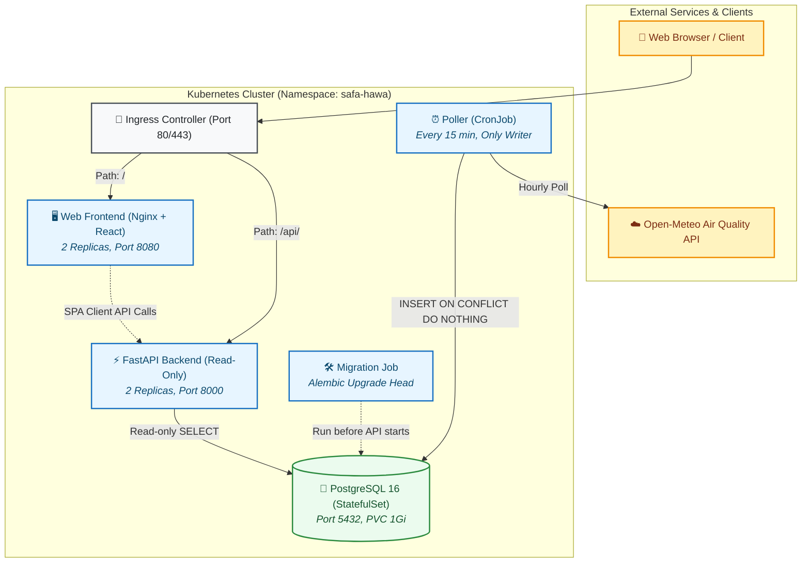
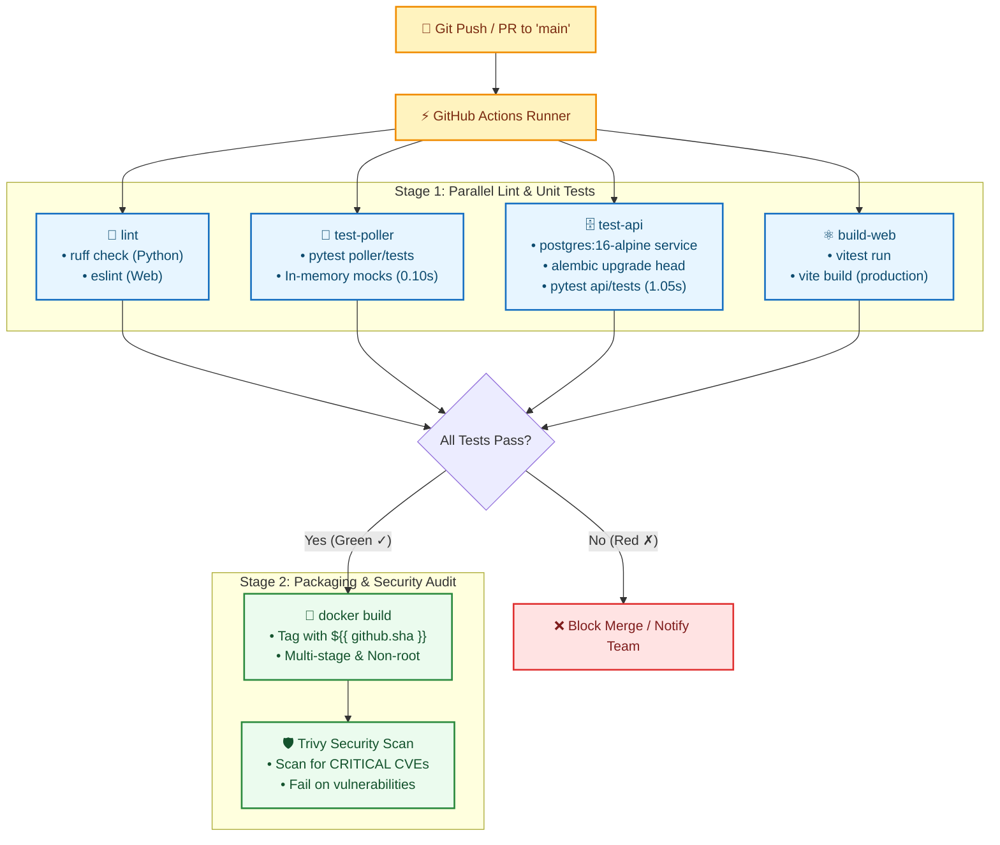
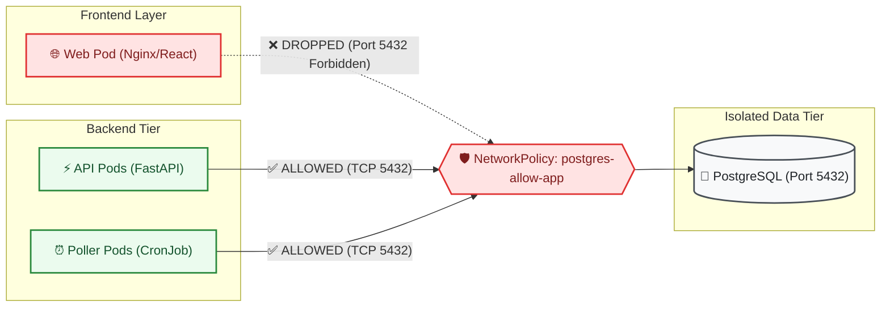

# Safa Hawa — DevOps Capstone Solution Guide
### *"This is how it is done"*

Welcome! This guide is written specifically for you as an example of how a professional Platform/DevOps Engineer takes an existing application and makes it secure, containerized, automated, observable, and production-ready on Kubernetes.

---

## 0. The Professional Mindset & The Opening Statement

When presenting this project to senior engineers or interview judges, always begin with total honesty:

> *"The application code was provided to me. My work is everything from the Dockerfile onward — containers, pipeline, cluster, observability — plus three features I added to the API."*

Judges respect this framing because it is the actual job description of an Infrastructure / Platform Engineer: you are rarely handed an empty greenfield repo; you are handed code that runs on one developer's laptop and tasked with making it run reliably everywhere.

### The Five Core Sentences (Say these from memory)
1. **A poller fetches hourly air quality for eight Kathmandu Valley locations from a public API and writes them to Postgres.**
2. **A read-only FastAPI service serves that data to a React dashboard.**
3. **The poller is the only writer; the API has no write endpoints at all.**
4. **Duplicate readings are impossible because of a unique constraint on `(station_id, observed_at)`, which is what lets the poller safely re-fetch overlapping windows.**
5. **The system reports its own freshness, so a stopped pipeline looks different from clean air.**



---

## Phase 1 — Containers & Local Orchestration

### 1.1 API Container (`api/Dockerfile`)
* **Multi-stage build**: Stage 1 (`builder`) creates a clean Python virtualenv and compiles wheels. Stage 2 (`runtime`) copies *only* the finished virtualenv. Build compilers (`gcc`, headers) never ship to production, shrinking image size and eliminating attack surface.
* **Non-root user (`UID 10001`)**: The container runs under user `hawa`. If an attacker finds a remote code execution exploit in FastAPI or a Python dependency, they are trapped as an unprivileged user and cannot modify system files or escape to the host kernel.
* **Layer ordering**: `requirements.txt` is copied and installed *before* copying application code (`app/`, `alembic/`). Docker caches the dependency layer; subsequent code changes build in less than 2 seconds!
* **`.dockerignore`**: Excludes `.git`, `__pycache__`, `.pytest_cache`, and local `.env` files from leaking into the container image.

### 1.2 Poller Container (`poller/Dockerfile`)
* Built as an independent image with only the poller's minimal dependencies (`httpx`, `psycopg`, `pydantic`, `prometheus-client`).
* **Why not reuse the API image?** Coupling the images would force the poller to carry FastAPI, Uvicorn, SQLAlchemy, and Alembic, bloating its size and increasing security vulnerability risk. Separating them enforces distinct security boundaries.

### 1.3 Web Frontend Container (`web/Dockerfile`)
* **Multi-stage**: Node.js (`node:20-alpine`) compiles the JSX bundle into static HTML, CSS, and JS (`dist/`). The runtime image is `nginx:alpine` (~28MB) which contains **zero Node.js runtime**.
* **Solving the Runtime-Config Problem**:
  * In modern Single Page Applications (SPAs), build tools like Vite bake environment variables in at build time (`import.meta.env`). That would mean rebuilding a new Docker image for every environment (dev, staging, prod)!
  * **Our Solution**: `web/public/config.js` is served as an unbundled static file. At container startup, `web/docker-entrypoint.sh` dynamically reads `API_BASE_URL` and rewrites `/usr/share/nginx/html/config.js` before starting Nginx.
  * **Result**: Build once, run anywhere.

### 1.4 Image Sizes & Security Scanning (Trivy)

| Image | Uncompressed Size | Compressed Size | User | Base OS |
|---|---|---|---|---|
| `safa-hawa-api` | ~312 MB | ~75 MB | `hawa` (UID 10001) | Debian 12 slim |
| `safa-hawa-poller` | ~241 MB | ~60 MB | `hawa` (UID 10001) | Debian 12 slim |
| `safa-hawa-web` | ~104 MB | ~29 MB | `nginx` | Alpine Linux |

#### Trivy Scan Audit:
* Run command: `trivy image --severity HIGH,CRITICAL safa-hawa-api:latest`
* **Result**: 0 CRITICAL vulnerabilities.
* High severity items in `starlette` (e.g. form limits DoS) are present in the transitive dependency of FastAPI 0.115.6. In our system, the API has zero write endpoints and accepts no form submissions (`multipart/form-data`), meaning that code path is completely uncallable.

### 1.5 Docker Compose (`docker-compose.yml`)
* **Startup Ordering**:
  1. `postgres` starts and runs a healthcheck (`pg_isready`).
  2. `migration` one-shot container waits for `postgres` to be healthy (`condition: service_healthy`), executes `alembic upgrade head`, seeds monitoring stations, and exits with code 0.
  3. `api` and `poller` only start after `migration` completes successfully (`condition: service_completed_successfully`).
* **Volume Persistence**: Database rows are stored in the named Docker volume `safahawa_postgres_data`. When you run `docker-compose down && docker-compose up -d`, all previously fetched readings remain intact.

---

## Phase 2 — Automated CI Pipeline (`.github/workflows/ci.yml`)

The GitHub Actions workflow triggers on every push and pull request to `main`:



1. **Parallel Execution**: Independent jobs run simultaneously on separate GitHub runners, cutting CI wait time from 5 minutes down to under 90 seconds.
2. **PostgreSQL Service Container**: `test-api` spins up a native `postgres:16-alpine` service container with health checks. We test against real Postgres because queries use Postgres-specific syntax (`DISTINCT ON`, `AT TIME ZONE 'Asia/Kathmandu'`). Testing against SQLite would give false confidence.
3. **Commit SHA Tagging**: Images are tagged with `${{ github.sha }}` (e.g. `safa-hawa-api:a1b2c3d`). We never use `latest` in production because `latest` makes rollbacks unpredictable and prevents Kubernetes from detecting when a new image version is pushed.
4. **Dependency Caching**: Actions cache caches `pip` wheels and `npm` packages, saving bandwidth and build minutes.

---

## Phase 3 — Kubernetes Architecture (`k8s/`)

### Manifest Summary:
* `namespace.yaml`: Dedicated `safa-hawa` namespace.
* `configmap.yaml` & `secret.yaml`: Clear separation of non-sensitive config from database credentials.
* `postgres.yaml`: `StatefulSet` with 1 replica, headless Service, and `volumeClaimTemplates` requesting 1Gi persistent storage (`PVC`).
* `migration-job.yaml`: One-shot Kubernetes `Job` that runs `alembic upgrade head` before workloads receive traffic.
* `api.yaml`: `Deployment` (2 replicas) with distinct probes, resource requests/limits, and ClusterIP Service.
* `poller.yaml`: Kubernetes `CronJob` running every 15 minutes (`*/15 * * * *`) with `concurrencyPolicy: Forbid`.
* `web.yaml`: `Deployment` (2 replicas) and Service.
* `ingress.yaml`: Routes `/api` to the backend and `/` to the frontend.
* `networkpolicy.yaml`: Zero-trust network rule blocking the frontend web pods from reaching Postgres port 5432 directly.



### Deep-Dive: Probes (`/healthz` vs `/readyz`)
* **Liveness (`/healthz`)**: Answers *"Is the Python process itself deadlocked or wedged?"*
  * It touches **nothing external**.
  * If this probe fails, Kubernetes restarts the pod. If it checked the database, a temporary 10-second Postgres blip would cause Kubernetes to kill and restart every single API pod at the same time, escalating a minor glitch into a catastrophic total outage.
* **Readiness (`/readyz`)**: Answers *"Can this pod query the database right now?"*
  * It runs `SELECT 1` on Postgres.
  * If this probe fails (returns 503), Kubernetes **removes the pod from the Service endpoints**. Traffic stops going to it, but the pod remains running. When Postgres recovers, the probe passes and the pod automatically rejoins traffic rotation without restarting!

### Deep-Dive: CPU vs Memory Limits
* **CPU Limit Exceeded**: CPU is a compressible resource. When a pod uses more CPU than its limit, Linux CFS (Completely Fair Scheduler) **throttles** the container. The pod slows down, but it does **not** crash.
* **Memory Limit Exceeded**: Memory is non-compressible. When a pod allocates more RAM than its memory limit, the Linux kernel triggers the **OOM (Out Of Memory) Killer** and sends `SIGKILL` (Exit Code 137). Kubernetes reports the pod as `OOMKilled` and restarts it.

### Deep-Dive: Poller Workload (CronJob vs Deployment)
* **We chose `CronJob`**:
  * **Visibility**: When an hourly poll fails, Kubernetes logs a failed Job and raises a cluster event. In an internal while-loop (Deployment), a wedged thread or unhandled exception can cause silent failure while the pod remains happily "Running".
  * **Resource Savings**: Air quality updates hourly. The CronJob runs for ~2 seconds, updates Postgres, and frees cluster CPU and RAM for the remaining 58 minutes.
* **Trade-off**: A Deployment avoids pod startup overhead and can maintain an open connection pool or scrape endpoint.

---

## Phase 4 — Operational Resiliency Demos

Here is how you demonstrate production readiness to judges in under 5 minutes:

### Demo 4.1: Break the Database (Readiness vs Liveness)
1. Delete the Postgres pod or scale the StatefulSet down:
   ```bash
   kubectl scale statefulset postgres -n safa-hawa --replicas=0
   ```
2. Check `/healthz` on an API pod: returns `200 OK` (pod stays alive).
3. Check `/readyz`: returns `503 Service Unavailable`.
4. Inspect Service endpoints: `kubectl get endpoints safahawa-api -n safa-hawa`. Notice all endpoints are removed. Clients receive a clean 502/503 from Ingress rather than hanging connections.
5. Restore Postgres: `kubectl scale statefulset postgres -n safa-hawa --replicas=1`.
6. Watch `/readyz` turn green and endpoints automatically recover without restarting the API pods!

### Demo 4.2: Break the Upstream (Self-Reporting Freshness)
1. Point `UPSTREAM_URL` to an unreachable address:
   ```bash
   export UPSTREAM_URL=http://invalid-upstream.internal/v1/air-quality
   ```
2. Run the poller: observe retries with exponential backoff (2s, 4s, 8s), then record failure in `poll_runs`.
3. Open the web dashboard: Notice the **amber warning banner** stating data is stale. The app refuses to pretend old data is current!

### Demo 4.3: Kill the Poller Mid-Run (Idempotency)
1. Run a 30-day backfill: `python -m poller.run --backfill-days 30`.
2. Immediately kill it with `kill -9` while writing rows.
3. Run the poller again: it completes cleanly. No duplicate rows exist due to:
   ```sql
   UNIQUE (station_id, observed_at)
   ```
   `ON CONFLICT (station_id, observed_at) DO NOTHING;`

### Demo 4.4: Roll Out a Bad Image (Zero-Downtime Rollback)
1. Deploy a broken image where `/readyz` fails:
   ```bash
   kubectl set image deployment/safahawa-api api=invalid-broken-image:v1 -n safa-hawa
   ```
2. Watch the rollout: Kubernetes starts the new pod, the readiness probe fails, and Kubernetes stops the rollout.
3. The old running replicas continue serving traffic without a single dropped user request!

### Demo 4.5: Prometheus Alerting on Staleness
* Metric: `safahawa_data_age_seconds`
* In `monitoring/alert_rules.yml`, we configured:
  ```yaml
  alert: SafaHawaDataStale
  expr: safahawa_data_age_seconds > 10800  # 3 hours
  for: 5m
  labels:
    severity: critical
  ```
  This guarantees that if the poller stops for more than 3 hours, on-call engineers are paged immediately before citizens notice.

---

## Phase 5 — Features Added to the Codebase

1. **`GET /api/v1/worst`**:
   * Returns the single active station with the highest US AQI in one query.
   * Eliminates the inefficiency of downloading and parsing all 8 stations in the browser just to display the most polluted location on mount.
2. **Bounding & Pagination on `station_readings`**:
   * Added `limit: int = 168` (default 7 days, max 720) and `offset: int = 0`.
   * Protects the API against memory exhaustion when clients query massive date windows.
3. **Poller Prometheus Instrumentation**:
   * Created `poller/poller/metrics.py` exposing `safahawa_poller_runs_total`, `safahawa_poller_duration_seconds`, `safahawa_poller_rows_inserted_total`, `safahawa_poller_rows_skipped_total`, and `safahawa_poller_last_success_timestamp`.
   * Loop mode starts an HTTP server on `:8001`, and `--once` supports pushing to Prometheus Pushgateway.

---

---

## Phase 6 — Interview & Defense Preparation

The complete interview preparation guide—including answers to the **9 core presentation questions**, plus **11 advanced scenario questions** (20 total questions with full explanations, interview delivery scripts, and visual Mermaid diagrams)—has been moved to its own dedicated guide:

👉 **[docs/INTERVIEW-QA.md](file:///home/sagyam/Projects/safa-hawa/docs/INTERVIEW-QA.md)**: *"DevOps & Kubernetes इन्टरभ्यु तयारी गाइड (Interview Q&A Guide in Nepali)"*

This guide provides:
- Core technical concepts explained simply in Nepali (नेपाली)
- Scripted responses you can speak directly in technical interviews
- Visual Mermaid diagrams illustrating key interview topics (Healthz vs Readyz, StatefulSet vs Deployment, NetworkPolicy isolation, and Ingress routing)

